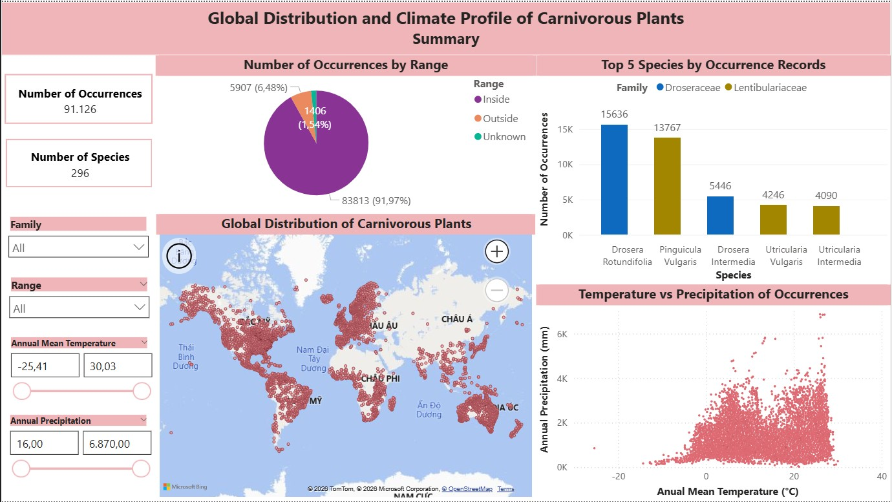
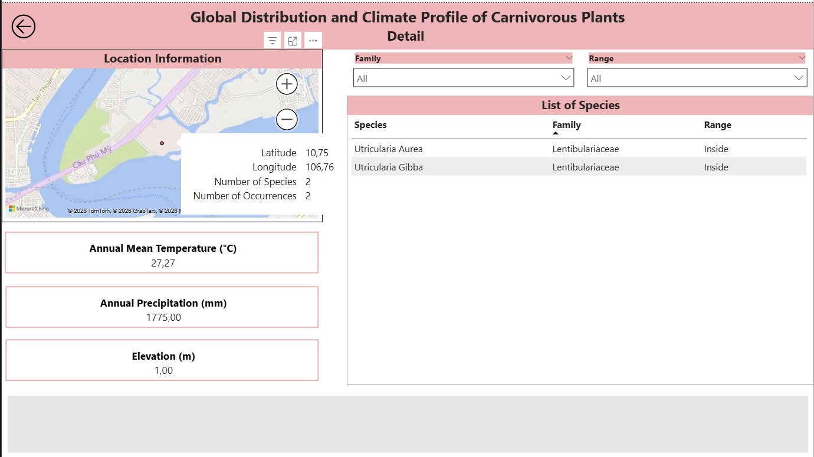

# Interactive Carnivorous Plant Dashboard with PowerBI

## Overview

This project presents an interactive dashboard for exploring the geographic distribution, classification, and environmental characteristics of carnivorous plants. It enables examination of relationships between species occurrence, climate, and geographic location through interactive visualizations. The dashboard was developed using Power BI.

## Data

The dashboard was built using the Global Carnivorous Plants with Climate Dataset, containing occurrence records of carnivorous plant species. The dataset consists of 92,617 observations and 29 variables, including taxonomic information, species range, geographic coordinates, and 19 bioclimatic variables at each observation location. The dataset is publicly available at: <https://www.kaggle.com/datasets/erickfhernandezp/global-carnivorous-plants-with-climate-data>

During preprocessing, the *num.precision* variable, a metadata field indicating the precision of geographic coordinates, was removed due to 46.75% missing values. The *genus* and *species* variables were removed due to redundancy with the *study.name* variable, which already contains combined *genus* and *species* information. Additionally, the original *cat_genus* variable was removed due to ambiguity, as its values didn't correspond to genus categories. The *study.name* variable was renamed to *genus_species* to better reflect its values. All preprocessing was performed through Power Query Editor.

## Methods

An interactive Power BI dashboard was developed to explore the global distribution of carnivorous plants and the environmental characteristics of their occurrence locations. The dashboard consists of two pages: *Summary* and *Detail*. The Summary page provides an overview of global carnivorous plant occurrence patterns, featuring the total number of occurrence records and species, a geographic map of occurrence locations, a pie chart showing the distribution of occurrence records by species range, a bar chart displaying the top 5 species by occurrence records, and a scatter plot showing the spread of occurrence records across annual mean temperature and annual precipitation. These visualizations are interconnected, allowing users to explore occurrence patterns through selection interactions, with optional filtering by plant family, species range category, and ranges of annual mean temperature and annual precipitation.

By using drill-through on a selected location in the Summary page map, users can navigate to the Detail page, which presents location-specific information. This page includes a map highlighting the selected occurrence location with hover interaction revealing geographic and occurrence details, cards displaying annual mean temperature, annual precipitation, and elevation, and a table listing the carnivorous plant species recorded at that location. Additional filters for plant family and species range category can be applied to the table to further explore the listed species.

## Results

***Figure 1:** Summary page*

The dashboard reveals the global distribution of carnivorous plant occurrence records across a wide range of climatic conditions. Occurrence records are concentrated in the Americas, Europe, Australia, and parts of Africa and Asia. Most occurrence records fall within the known geographic range of their respective species, while only a small proportion are classified as outside or unknown. The most frequently recorded species include *Drosera Rotundifolia*, *Pinguicula Vulgaris*, *Drosera Intermedia*, *Utricularia Vulgaris*, and *Utricularia Intermedia*, all belonging to either the *Droseraceae* or the *Lentibulariaceae* family.

The scatter plot shows that carnivorous plants occur across diverse climatic environments, with most records occurring within a broad range of annual mean temperatures (0 - 30°C) and annual precipitation levels (0 - 3000mm).

Notably, most occurrence records outside the known geographic ranges of their respective species are located in Australia, suggesting potential areas where species range information may require further investigation. Among the top 5 species with the highest number of occurrences, all five are represented in North America, Europe, and Japan, with many records concentrated in regions with annual mean temperatures of 0 - 10°C. This pattern may reflect the climatic conditions associated with these frequently recorded species, while also being influenced by differences in data availability across regions.

***Figure 2:** Detail page of the selected location (Latitude: 10.75°N; Longitude: 106.76°E)*

A detailed analysis of the location at 10.75°N, 106.76°E, within Cat Lai Ward, Ho Chi Minh City, Vietnam, was conducted. The selected location contains 2 occurrence records representing 2 species (*Utricularia Aurea* and *Utricularia Gibba*) from the family Lentibulariaceae, with both records occurring within their known geographic ranges. The environmental profile indicates an annual mean temperature of 27.27°C, annual precipitation of 1775mm, and an elevation of 1m, suggesting a low-elevation tropical environment with warm temperatures and substantial rainfall.
